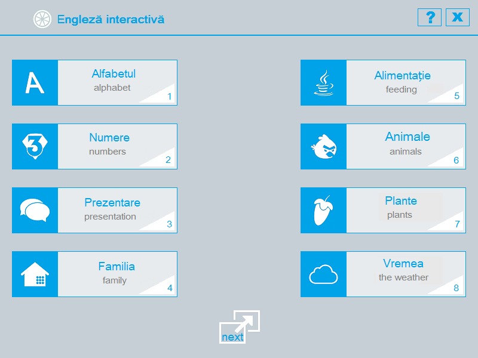
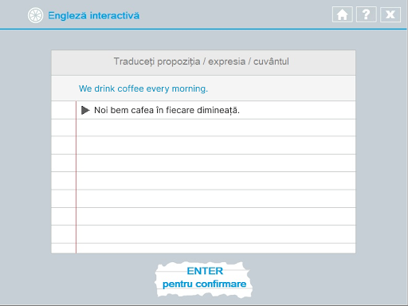

# 📖 Interactive English

### An English language learning application. Developed in 2017 using C++.

- The application was created for educational purposes for interactive learning of the English language.
- The application is easy to use thanks to its user-friendly interface.
- Lessons are summarized and structured to be more memorable.
- The knowledge gained can be verified through captivating tests.
 

The application is created with the following C++ entities:
- data structures 
- string processing algorithms
- user-defined function
- image and file manipulation
- standard libraries and functions for graphic interface

